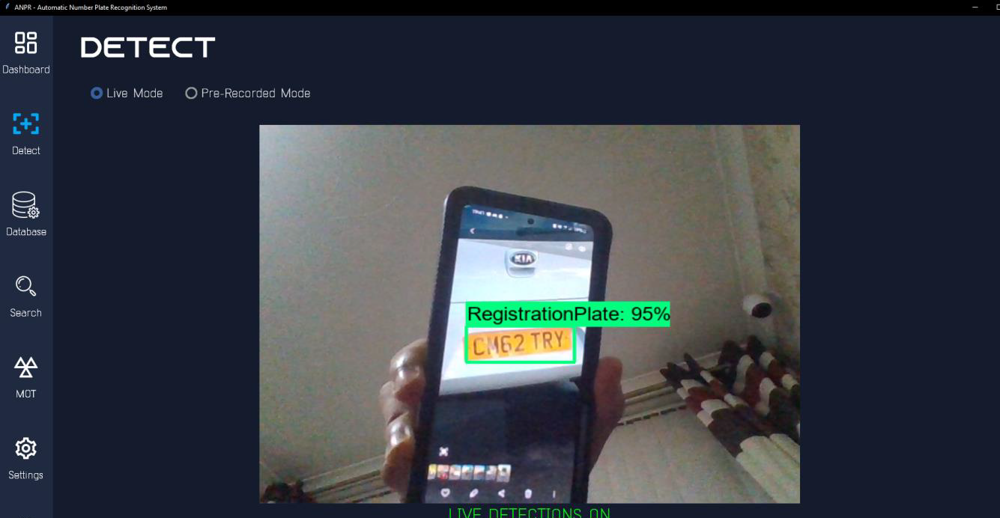

# Automatic Number Plate Recognition System

This project forms part of my A-Level Computer Science Project 2022. This project is a fully fledged ANPR system, with the following features:

- Licence plate recognition from both live camera and pre-recorded videos (.mp4 files)
- UK number plate and vehical lookup.
- Vehical Image and specification retrieval
- MOT and Milege History retrieval
- 

## Technical Description
- Graphical User Interface (GUI) made using Tkinter
- Registration/Login System
- Custom made API's, cloud hosted on Vercel
- Custom trained Machine Learning model in TensorFlow, also trained using a custom dataset
- Optical Image Recognition (OCR) integration using Google Cloud Vision
- User and vehical record MySQL database, cloud hosted on Oracle Cloud.

## Documentation
Full Documentation of this project can be seen at https://bit.ly/ANPRProject 

## Screenshots

